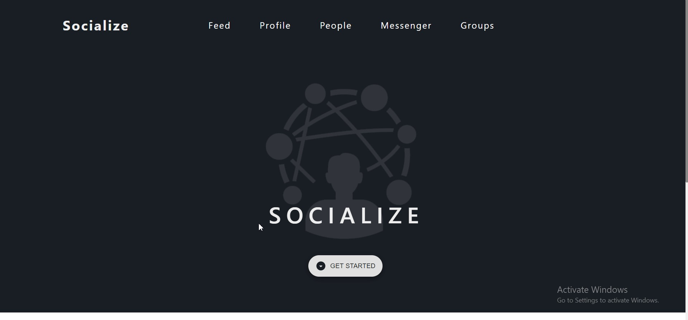

# Socialize

this project is the final project for the Advanced Software Development in Full-Stack JavaScript (401) course

## Project description

* A real time social media web app , in which a user can connect with his friends, chat with them, follow them , or create groups with them and more

[Watch a video demo here](https://youtu.be/TZf5xcvW0rU)

[Deployment](https://socialize401.netlify.app/)   
[Backend repo](https://github.com/socialize-401/socialize-back-end)   

## Team members

- Hiba Salem
- Amro Al Barham
- Yazan Tafesh
- Saeed Awwad

## Main Features

- Authentication and Authorization
- Email verification
- Cookies
- Post , Comment , Like
- Follow users
- Messages and video calls
- Create and join groups
- Notifications

## Resources and Technologies

* Built with React to communicate with a Node.js Express server, utilizing Socket.io with PostgreSQL in addition to pure CSS and Material-UI components.

- Front end

  - React
  - React-Cookies
  - React-Notifications
  - Material-UI

- Backend

  - Node.js
  - PostgreSQL
  - Socket.io
  - Express
  - Firebase

## versoin 
2.0.0 sept 2021 : frontend using react.js functional components ,  user interface , video calls , adding images 

